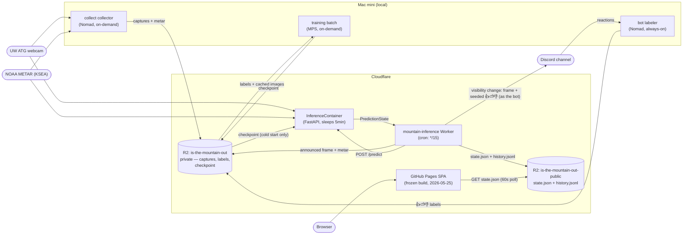
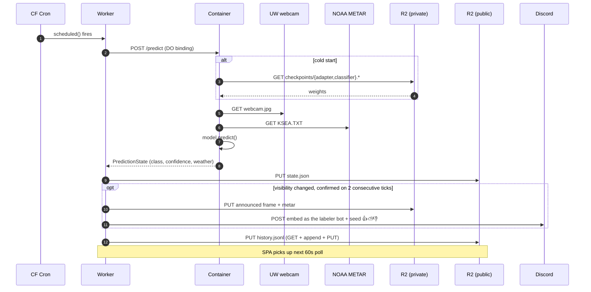
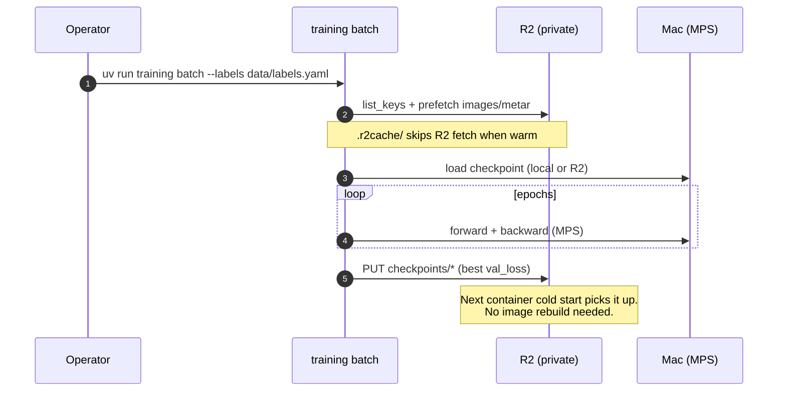

# is-the-mountain-out

Real-time image classifier that determines whether Mount Rainier is "out" (visible) from a live UW webcam, augmented with METAR weather data. ConvNeXt Tiny backbone + LoRA fine-tuning, trained on Apple Silicon (MPS), served from Cloudflare.

**Live site:** https://robogeosociety.github.io/is-the-mountain-out/
Append `?debug` to see confidence bars and the raw METAR readout.

> [!WARNING]
> **The site is currently down, and has been since 2026-08-07.** Two independent
> faults, neither fixable from this repo — see [Known outage](#known-outage-2026-08-07)
> for the two things an operator has to do.
>
> The URL above also replaces `https://is-the-mountain-out.pages.dev`, which this
> README advertised until 2026-08-24. That hostname does not resolve (NXDOMAIN):
> the Cloudflare Pages project it named does not exist, and no Cloudflare Pages
> deployment was ever recorded against this repository. GitHub Pages — which the
> 2026-05-25 migration intended to retire — is what has actually been serving all
> along.


*Mount Rainier, the UW ATG webcam (north-northwest), and KSEA METAR station.*

## Known outage (2026-08-07 →)

Two independent faults. Both need a human with Cloudflare dashboard access; neither
is a code change, which is why this section exists instead of a patch.

### 1. The data plane: the webcam this project reads no longer exists

At **2026-08-07T07:15Z** the `*/15` inference tick started failing and has not
succeeded since — **1,637 consecutive failures** as of 2026-08-24, every one of
them identical:

```
container /predict returned 500: {"detail":"HTTPError: 404 Client Error: Not Found
for url: https://a.atmos.washington.edu/data/images/webcam2_latest.jpg"}
```

UW retired the image. `webcam2_latest.jpg` is gone from the
`https://a.atmos.washington.edu/data/images/` directory listing, while its siblings
(`webcam0_latest.jpg`, `webcam1_latest.jpg`, `webcam1r_latest.jpg`) still return
`200 image/jpeg`. The camera's own page (`atmos.uw.edu/images/webcam2/`) still
renders and still links the dead image, so this is an upstream breakage, not a
move we can chase with a URL rewrite.

Consequently `state.json` is frozen at its 2026-08-07T06:45:32Z reading and the SPA
shows its stale state.

**This is a product decision, not a config edit.** `webcam1` is alive but points
somewhere else; the classifier was fine-tuned on webcam2's exact framing (Rainier
just right of the Chemistry Building stack), so repointing `[webcam] url` in
`mountain.toml` swaps the model's input distribution out from under it and almost
certainly requires re-collection and re-training. Pick the camera first, then
retrain — do not just edit the URL.

### 2. The front end: R2 CORS still names the pre-rename GitHub org

The public bucket's CORS policy allows exactly one origin, `https://tommyroar.github.io`
— the org name **before** the rename to `robogeosociety`. The live site is served
from `https://robogeosociety.github.io`, so every `state.json` fetch is blocked:

```
Access to fetch at 'https://pub-66d3d1f139004e29b2afcb5fba49bdb3.r2.dev/state.json'
from origin 'https://robogeosociety.github.io' has been blocked by CORS policy:
No 'Access-Control-Allow-Origin' header is present on the requested resource.
```

The page renders **STATE UNAVAILABLE**. This fault is independent of fault 1 — it
would still break the site on the day the webcam comes back.

**Fix:** add `https://robogeosociety.github.io` to the `AllowedOrigins` of the
`is-the-mountain-out-public` bucket's CORS policy (R2 → the bucket → Settings →
CORS Policy). Keeping the old origin costs nothing; adding the new one is the
whole fix.

### Also worth deciding

- **The SPA build is frozen.** GitHub Pages is still enabled (`build_type: workflow`,
  source `main`) but the workflow that built it — `.github/workflows/update.yml` —
  was deleted in `85923e5` when the project migrated to Cloudflare Pages. It has
  been serving the 2026-05-25 artifact ever since. Either restore a build workflow
  or stand the Pages project back up; today the site cannot be redeployed at all.
  Note that the served build uses `base = "/is-the-mountain-out/"` while
  `web/vite.config.ts` now sets `base = "/"`, so a naive rebuild onto GitHub Pages
  would 404 its own assets.
- **Cloudflare Pages.** Restoring the project (root `web`, build
  `npm install && npm run build`, output `web/dist`) is a live option — this README
  no longer claims it exists either way.

## Architecture



### Inference tick (every 15 min)



### Training cycle (on demand)



## Current model state

Snapshot of the checkpoint currently live in R2 at `checkpoints/`:

| Field | Value |
|---|---|
| Backbone | `convnext_tiny` (timm, ImageNet pretrained) |
| Adapter | LoRA r=8 α=16 on `fc1`/`fc2` MLP layers |
| Head input | 768-dim image features ⊕ 2-dim weather (visibility, ceiling) |
| Classes | 0 = Not Out, 1 = Full, 2 = Partial |
| Capture window | 2026-02-22 → 2026-04-24 (55 days) |
| Captures in R2 | 2,057 jpgs + matching METAR |
| Labeled dataset | 2,000 (1,727 Not Out / 109 Full / 164 Partial) |
| Best val loss | 0.0782 |
| Val accuracy | 97.6% (15% stratified held-out, single-epoch run) |
| Checkpoint size | ~2.9 MB total (`adapter_model.safetensors` 2.1 MB + `classifier.pt` 795 KB + config 1 KB) |

Class-wise evaluation against the full labeled set (note: this is training data, not held-out — useful as a sanity check on class balance, not for generalization claims):

| Class   | Precision | Recall | F1   | Support |
|---------|----------:|-------:|-----:|--------:|
| Not Out |      1.00 |   0.99 | 0.99 |   1,727 |
| Full    |      0.88 |   1.00 | 0.94 |     109 |
| Partial |      0.93 |   0.94 | 0.94 |     164 |
| **macro avg** | **0.94** | **0.98** | **0.96** | 2,000 |

Targets the model is trying to meet before announcing "out" with confidence:

- Accuracy > 95% on a diverse held-out set
- Precision > 98% (priority on avoiding false positives — "the mountain is out" when it isn't)
- F1 > 0.92

## Repository layout

```
mountain.toml         configuration (mountain, webcam, METAR, training, R2 storage, bot)
collect/              capture collector (Nomad job), R2 storage backend, classifier server
bot/                  Discord reaction-labeling bot (see BOT.md)
train/                model definition, scheduler, config loader, checkpoints
tools/                labeling backend, evaluation/pruning/ab-test scripts, predict_state
inference/            FastAPI server + Dockerfile for the Cloudflare Container
worker/               Cloudflare Worker source (TypeScript) + wrangler.toml
web/                  Public SPA (Vite + React) — source of the GitHub Pages build
ui/                   Internal classifier UI for bulk labeling (Vite + React)
.github/workflows/    CI — ruff, worker tests, and the Worker deploy to Cloudflare
scripts/              deploy-worker.sh — break-glass manual Worker redeploy
```

## Commands

Run from the repo root.

```bash
# Capture
uv run collect collect        # one capture (webcam + METAR) → local + R2 if [storage] enabled
uv run collect live           # continuous capture loop

# Training (reads from R2, writes checkpoint back to R2)
uv run training batch --labels data/labels.yaml --epochs N
uv run training live          # continuous live capture + gradient accumulation
uv run training once          # single capture + train cycle, then exit

# Internal labeling UI
uv run classify start [data_folder]
uv run classify stop

# Discord reaction-labeling bot (see BOT.md; needs cf.env)
uv run --group bot bot run          # reaction labeling + startup sweep
uv run --group bot bot post-once    # post one labelable capture, then exit

# Inference (server-side, used by the Cloudflare Container)
uv run python tools/predict_state.py --config mountain.toml

# Cloudflare Worker tests (also run on every PR by .github/workflows/worker-ci.yml)
cd worker && npm ci && npm test && npm run typecheck
```

## Deploying the Worker

**The Worker deploys from CI.** Pushing to `main` with changes under `worker/**`
runs `.github/workflows/deploy-worker.yml`: worker tests + typecheck, then
`wrangler deploy` into the `production` GitHub environment, recording a GitHub
Deployment so the [Environments page](https://github.com/robogeosociety/is-the-mountain-out/deployments)
shows what is actually live. Redeploy the current `main` by hand with:

```bash
gh workflow run deploy-worker.yml
```

CI authenticates with the repo secret `CLOUDFLARE_API_TOKEN` (see `CLAUDE.md` →
Deployment (Cloudflare) for the required token scope). Without it the deploy job
fails at its preflight step with an explicit message and deploys nothing.

`scripts/deploy-worker.sh` is the **break-glass** path — for when Actions is
down, the token is expired, or an uncommitted tree must ship. It uses your own
`wrangler login` session and warns before it runs.

## Configuration

Single source of truth: `mountain.toml`.

- `[mountain]`, `[webcam]`, `[weather]` — target mountain + data sources
- `[training]` — schedule, gradient accumulation, LoRA hyperparams
- `[collection]` — capture cadence
- `[storage]` — R2 backend (`backend = "r2"`, account/bucket/cache_dir)

Worker-side policy lives in `worker/wrangler.toml` `[vars]`, so thresholds move
without a code change:

- `ALERT_MIN_CONFIDENCE`, `LABEL_COOLDOWN_HOURS` — what the channel says about the
  mountain (see `worker/src/transition.ts`)
- `HEALTH_ALERT_AFTER_FAILURES`, `HEALTH_REALERT_HOURS` — when the channel says the
  *pipeline* is broken (see `worker/src/health.ts`)

R2 S3 credentials (`R2_ACCESS_KEY_ID`, `R2_SECRET_ACCESS_KEY`) live in `cf.env` (gitignored). The Worker holds the same values as secrets so the container can pull its checkpoint from R2 on startup.

## What runs where

| Component | Host | Trigger |
|---|---|---|
| Capture collector | Mac mini (Nomad) | Cron, on-demand |
| Discord labeling bot | Mac mini (Nomad) | Always-on (harvests reactions; the Worker does the posting) |
| Training | Mac mini (MPS) | On-demand (`uv run training batch`) |
| Inference cron | Cloudflare Worker | `*/15 * * * *` |
| Inference compute | Cloudflare Container | Worker invocation |
| Storage | Cloudflare R2 | (always) |
| Public SPA | GitHub Pages | Frozen — its build workflow was deleted 2026-05-25 |
| Container image | GHCR | Built by GH Actions on push to main |
| Worker deploy | GitHub Actions | Push to main touching `worker/**`, or `gh workflow run deploy-worker.yml` |

GitHub hosts the source repo, the container image registry, the Worker's deploy pipeline — and, as it turns out, the live site. The 2026-05-25 migration to Cloudflare Pages was written up as making nothing *user-facing* depend on GitHub, but that Pages project does not exist today, so the claim never held: the SPA is served by GitHub Pages. Prediction itself is independent of GitHub (the Worker's cron and the Container run on Cloudflare), and if Actions is down the Worker can still be shipped by hand via `scripts/deploy-worker.sh`.

## Network access (Mac mini)

The internal labeling UI is exposed over the LAN and Tailscale:
- LAN: http://tommys-mac-mini.local:5188/classify/
- Tailscale: https://tommys-mac-mini.tail59a169.ts.net/classify/

## Setup

- [uv](https://github.com/astral-sh/uv) for Python deps; Mac with Apple Silicon for MPS.
- Node.js 20+ for the SPA and the internal classifier UI.
- `uv venv && uv pip install -e .` once at the top of the repo.
- `cp cf.env.example cf.env` and fill in R2 credentials (see `CLAUDE.md` for details).

See `CLAUDE.md` for in-repo conventions (data layout, Vite port registry, etc.).
