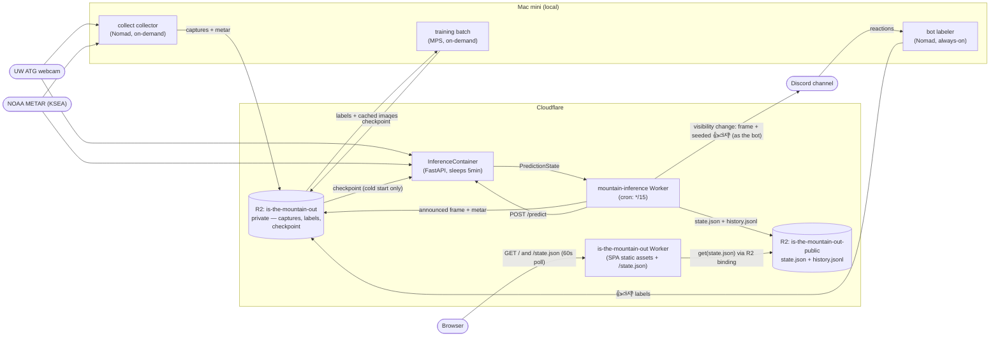
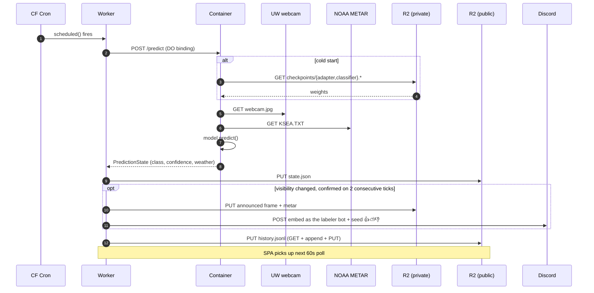
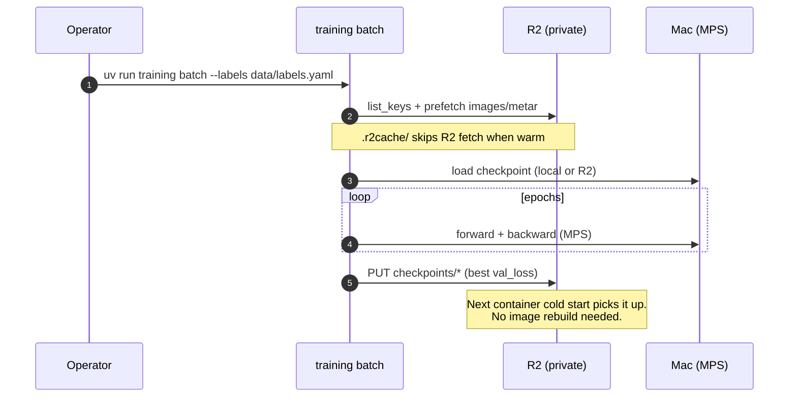

# is-the-mountain-out

Real-time image classifier that determines whether Mount Rainier is "out" (visible) from a live UW webcam, augmented with METAR weather data. ConvNeXt Tiny backbone + LoRA fine-tuning, trained on Apple Silicon (MPS), served from Cloudflare.

**Live site:** https://mountainisout.robogeosociety.xyz (also at https://is-the-mountain-out.tommy-b-doerr.workers.dev)
Append `?debug` to see confidence bars and the raw METAR readout.

> [!NOTE]
> The site was down from 2026-08-07 to 2026-09-02 — three independent faults,
> written up below in [Outage post-mortem](#outage-post-mortem-2026-08-07--2026-09-02).
> All three are resolved. The old GitHub Pages URL,
> `https://robogeosociety.github.io/is-the-mountain-out/`, still serves the
> 2026-05-25 build and works again as a fallback, but it is no longer the site.


*Mount Rainier, the UW ATG webcam (north-northwest), and KSEA METAR station.*

## Outage post-mortem (2026-08-07 → 2026-09-02)

The README advertised `https://is-the-mountain-out.pages.dev` until 2026-08-24. That
hostname never resolved: the Cloudflare Pages project the 2026-05-25 migration
described was never created, and GitHub Pages — which that migration meant to
retire — kept serving a frozen build. Chasing the dead URL found three faults.

### 1. The data plane: UW's webcam2 image went away, then came back

At **2026-08-07T07:00Z** `webcam2_latest.jpg` started returning 404 upstream, and
every `*/15` inference tick failed the same way until **2026-08-27T21:15Z** —
**1,970 consecutive failures, 20.6 days** — when UW restored the image. Nothing
changed on this side; `state.json` simply started moving again.

The tick's error path appended to `history.jsonl` and called `console.error`,
which is why nobody noticed. `worker/src/health.ts` now announces an outage in
Discord after `HEALTH_ALERT_AFTER_FAILURES` consecutive failed ticks and posts an
all-clear on recovery (see `NOTIFICATIONS.md`). The camera is still `webcam2`; the
classifier was fine-tuned on its exact framing, so if UW retires it for good the
fix is a retrain against a sibling camera, not a URL edit.

### 2. The front end: R2 CORS still named the pre-rename GitHub org

The public bucket's CORS policy allowed exactly one origin,
`https://tommyroar.github.io` — the org name *before* the rename to
`robogeosociety`. Every `state.json` fetch from the live origin was blocked and the
page rendered **STATE UNAVAILABLE**, independently of fault 1.

Fixed 2026-09-02 two ways. `https://robogeosociety.github.io` was added to the
bucket's `AllowedOrigins` (via `wrangler r2 bucket cors set`), so the GitHub Pages
build works again. And the new site does not use CORS at all: the
`is-the-mountain-out` Worker serves `/state.json` same-origin from the R2 binding
(`web/worker/index.ts`), so a future hostname change cannot break it this way.

### 3. The build: the SPA could not be redeployed

GitHub Pages was still enabled, but the workflow that built it was deleted in
`85923e5` for a Cloudflare Pages project that never existed. The served build was
the 2026-05-25 artifact, with `base = "/is-the-mountain-out/"` baked in.

Fixed by hosting the SPA as a Cloudflare Worker with static assets
(`web/wrangler.toml`) and deploying it from CI (`.github/workflows/deploy-web.yml`)
on every push to `main` touching `web/**`. See [Deploying](#deploying).

## Architecture



### Inference tick (every 15 min)



### Training cycle (on demand)



## Current model state

Snapshot of the checkpoint currently live in R2 at `checkpoints/`:

| Field | Value |
|---|---|
| Backbone | `convnext_tiny` (timm, ImageNet pretrained) |
| Adapter | LoRA r=8 α=16 on `fc1`/`fc2` MLP layers |
| Head input | 768-dim image features ⊕ 2-dim weather (visibility, ceiling) |
| Classes | 0 = Not Out, 1 = Full, 2 = Partial |
| Capture window | 2026-02-22 → 2026-04-24 (55 days) |
| Captures in R2 | 2,057 jpgs + matching METAR |
| Labeled dataset | 2,000 (1,727 Not Out / 109 Full / 164 Partial) |
| Best val loss | 0.0782 |
| Val accuracy | 97.6% (15% stratified held-out, single-epoch run) |
| Checkpoint size | ~2.9 MB total (`adapter_model.safetensors` 2.1 MB + `classifier.pt` 795 KB + config 1 KB) |

Class-wise evaluation against the full labeled set (note: this is training data, not held-out — useful as a sanity check on class balance, not for generalization claims):

| Class   | Precision | Recall | F1   | Support |
|---------|----------:|-------:|-----:|--------:|
| Not Out |      1.00 |   0.99 | 0.99 |   1,727 |
| Full    |      0.88 |   1.00 | 0.94 |     109 |
| Partial |      0.93 |   0.94 | 0.94 |     164 |
| **macro avg** | **0.94** | **0.98** | **0.96** | 2,000 |

Targets the model is trying to meet before announcing "out" with confidence:

- Accuracy > 95% on a diverse held-out set
- Precision > 98% (priority on avoiding false positives — "the mountain is out" when it isn't)
- F1 > 0.92

## Repository layout

```
mountain.toml         configuration (mountain, webcam, METAR, training, R2 storage, bot)
collect/              capture collector (Nomad job), R2 storage backend, classifier server
bot/                  Discord reaction-labeling bot (see BOT.md)
train/                model definition, scheduler, config loader, checkpoints
tools/                labeling backend, evaluation/pruning/ab-test scripts, predict_state
inference/            FastAPI server + Dockerfile for the Cloudflare Container
worker/               Cloudflare Worker source (TypeScript) + wrangler.toml
web/                  Public SPA (Vite + React) + the Worker that serves it (worker/, wrangler.toml)
ui/                   Internal classifier UI for bulk labeling (Vite + React)
.github/workflows/    CI — ruff, pytest, worker + web checks, and both Cloudflare deploys
scripts/              deploy-worker.sh — break-glass manual Worker redeploy
```

## Commands

Run from the repo root.

```bash
# Capture
uv run collect collect        # one capture (webcam + METAR) → local + R2 if [storage] enabled
uv run collect live           # continuous capture loop

# Training (reads from R2, writes checkpoint back to R2)
uv run training batch --labels data/labels.yaml --epochs N
uv run training live          # continuous live capture + gradient accumulation
uv run training once          # single capture + train cycle, then exit

# Internal labeling UI
uv run classify start [data_folder]
uv run classify stop

# Discord reaction-labeling bot (see BOT.md; needs cf.env)
uv run --group bot bot run          # reaction labeling + startup sweep
uv run --group bot bot post-once    # post one labelable capture, then exit

# Inference (server-side, used by the Cloudflare Container)
uv run python tools/predict_state.py --config mountain.toml

# Cloudflare Worker tests (also run on every PR by .github/workflows/worker-ci.yml)
cd worker && npm ci && npm test && npm run typecheck

# Public SPA: dev server (proxies /state.json to R2), lint + typecheck + build (web-ci.yml)
cd web && npm ci && npm run dev
cd web && npm run lint && npm run build
```

## Deploying

Two Workers, both deployed from CI on a push to `main`, each inside its own GitHub
environment so the [Environments page](https://github.com/robogeosociety/is-the-mountain-out/deployments)
records what is actually live:

| Worker | Source | Workflow | Trigger paths | Environment |
|---|---|---|---|---|
| `mountain-inference` (cron + container) | `worker/` | `deploy-worker.yml` | `worker/**` | `production` |
| `is-the-mountain-out` (the site) | `web/` | `deploy-web.yml` | `web/**` | `production-web` |

Each workflow first runs the same checks that gate PRs (`worker-ci.yml` /
`web-ci.yml`), then `wrangler deploy`. Redeploy the current `main` by hand with:

```bash
gh workflow run deploy-worker.yml   # inference Worker
gh workflow run deploy-web.yml      # the site
```

CI authenticates with the repo secret `CLOUDFLARE_API_TOKEN` (see `CLAUDE.md` →
Deployment (Cloudflare) for the required token scope). Without it the deploy job
fails at its preflight step with an explicit message and deploys nothing.

`scripts/deploy-worker.sh` is the **break-glass** path for the inference Worker —
for when Actions is down, the token is expired, or an uncommitted tree must ship.
It uses your own `wrangler login` session and warns before it runs. The site's
equivalent is simply `cd web && npm run deploy`.

## Configuration

Single source of truth: `mountain.toml`.

- `[mountain]`, `[webcam]`, `[weather]` — target mountain + data sources
- `[training]` — schedule, gradient accumulation, LoRA hyperparams
- `[collection]` — capture cadence
- `[storage]` — R2 backend (`backend = "r2"`, account/bucket/cache_dir)

Worker-side policy lives in `worker/wrangler.toml` `[vars]`, so thresholds move
without a code change:

- `ALERT_MIN_CONFIDENCE`, `LABEL_COOLDOWN_HOURS` — what the channel says about the
  mountain (see `worker/src/transition.ts`)
- `HEALTH_ALERT_AFTER_FAILURES`, `HEALTH_REALERT_HOURS` — when the channel says the
  *pipeline* is broken (see `worker/src/health.ts`)

R2 S3 credentials (`R2_ACCESS_KEY_ID`, `R2_SECRET_ACCESS_KEY`) live in `cf.env` (gitignored). The Worker holds the same values as secrets so the container can pull its checkpoint from R2 on startup.

## What runs where

| Component | Host | Trigger |
|---|---|---|
| Capture collector | Mac mini (Nomad) | Cron, on-demand |
| Discord labeling bot | Mac mini (Nomad) | Always-on (harvests reactions; the Worker does the posting) |
| Training | Mac mini (MPS) | On-demand (`uv run training batch`) |
| Inference cron | Cloudflare Worker | `*/15 * * * *` |
| Inference compute | Cloudflare Container | Worker invocation |
| Storage | Cloudflare R2 | (always) |
| Public SPA | Cloudflare Worker `is-the-mountain-out` (static assets) | Push to main touching `web/**`, or `gh workflow run deploy-web.yml` |
| Container image | GHCR | Built by GH Actions on push to main |
| Worker deploy | GitHub Actions | Push to main touching `worker/**`, or `gh workflow run deploy-worker.yml` |

GitHub hosts the source repo, the container image registry, and both deploy
pipelines; nothing user-facing runs there. The site and prediction both run on
Cloudflare, and if Actions is down either Worker can still be shipped by hand
(`scripts/deploy-worker.sh`, `cd web && npm run deploy`). The 2026-05-25 migration
claimed this and did not deliver it — the Cloudflare Pages project it described was
never created and GitHub Pages served a frozen build until 2026-09-02; see the
post-mortem above.

## Network access (Mac mini)

The internal labeling UI is exposed over the LAN and Tailscale:
- LAN: http://tommys-mac-mini.local:5188/classify/
- Tailscale: https://tommys-mac-mini.tail59a169.ts.net/classify/

## Setup

- [uv](https://github.com/astral-sh/uv) for Python deps; Mac with Apple Silicon for MPS.
- Node.js 20+ for the SPA and the internal classifier UI.
- `uv venv && uv pip install -e .` once at the top of the repo.
- `cp cf.env.example cf.env` and fill in R2 credentials (see `CLAUDE.md` for details).

See `CLAUDE.md` for in-repo conventions (data layout, Vite port registry, etc.).
