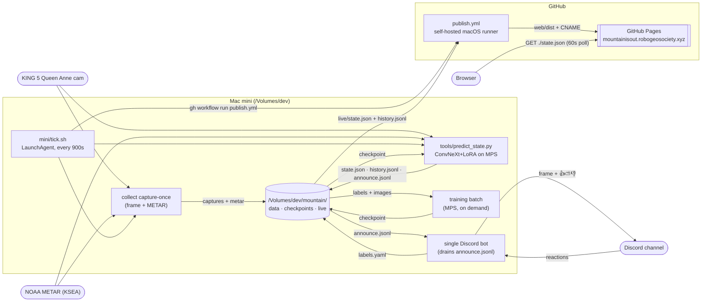
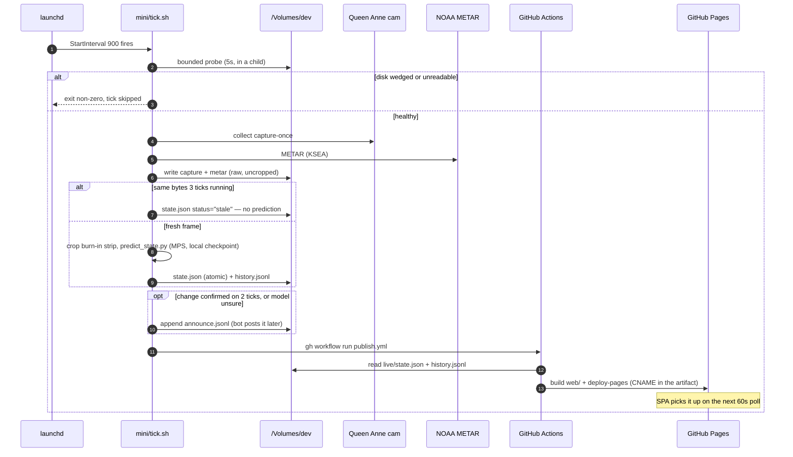
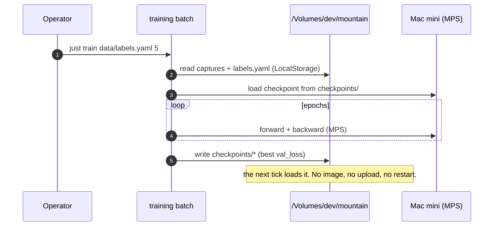

# is-the-mountain-out

Real-time image classifier that determines whether Mount Rainier is "out" (visible) from a live Seattle webcam, augmented with METAR weather data. ConvNeXt Tiny backbone + LoRA fine-tuning, trained and now *served* from Apple Silicon (MPS) on a Mac mini, published as a static site.

**Live site:** https://mountainisout.robogeosociety.xyz
(fallback: https://robogeosociety.github.io/is-the-mountain-out/)
Append `?debug` to see confidence bars and the raw METAR readout.

> [!NOTE]
> **2026-09: Cloudflare is out of the path.** Inference ran as a Cloudflare
> Worker + Container on a `*/15` cron and had been failing since 2026-09-15.
> It now runs natively on the Mac mini every 15 minutes (`mini/`), writes
> `state.json` to the dev disk, and a GitHub Pages deploy publishes it. No
> Worker, no Container, no R2, no Nomad. The older outage below is history.

> [!CAUTION]
> **2026-09-24: the camera changed and the model has not caught up.** UW's ATG
> webcam 404'd for good on ~2026-09-15 and is gone from their server listing;
> the feed is now the **KING 5 Queen Anne tower camera** (`WEBCAMS.md`).
> Different view, so **the existing checkpoint is invalid for this framing and
> the labels restart from zero**.
>
> **The site does not guess in the meantime.** `[webcam] era` names the live
> camera and every checkpoint records the era it was trained under
> (`train/checkpoint_era.py`); when they disagree the old weights are **never
> loaded**, `state.json` carries `status: "unvalidated"` with no prediction,
> and the page shows **CHECKING…**. No Discord alerts fire either. What *does*
> keep running is the labeling loop — a frame still goes to the channel on the
> usual cooldown so 👍/⛅/👎 reactions accumulate, which is the only route to a
> checkpoint that would be valid here. Details: `TRAINING.md` and
> `CHECKPOINTS.md`.


*Mount Rainier, the webcam (north-northwest) and the KSEA METAR station. The
camera moved from UW's ATG building to KING 5's Queen Anne tower on 2026-09-24
— a few km, same sightline; the map is close enough to still read true.*

## Outage post-mortem (2026-08-07 → 2026-09-02)

> [!NOTE]
> History, kept for the lessons. The Cloudflare files it names (`worker/`,
> `web/worker/index.ts`, `web/wrangler.toml`, the two deploy workflows) were
> deleted in 2026-09 when inference moved to the mini and the site moved to
> GitHub Pages — which is, with a working deploy this time, where that
> migration was trying to go.

The README advertised `https://is-the-mountain-out.pages.dev` until 2026-08-24. That
hostname never resolved: the Cloudflare Pages project the 2026-05-25 migration
described was never created, and GitHub Pages — which that migration meant to
retire — kept serving a frozen build. Chasing the dead URL found three faults.

### 1. The data plane: UW's webcam2 image went away, then came back

At **2026-08-07T07:00Z** `webcam2_latest.jpg` started returning 404 upstream, and
every `*/15` inference tick failed the same way until **2026-08-27T21:15Z** —
**1,970 consecutive failures, 20.6 days** — when UW restored the image. Nothing
changed on this side; `state.json` simply started moving again.

The tick's error path appended to `history.jsonl` and called `console.error`,
which is why nobody noticed. `worker/src/health.ts` now announces an outage in
Discord after `HEALTH_ALERT_AFTER_FAILURES` consecutive failed ticks and posts an
all-clear on recovery (see `NOTIFICATIONS.md`). The camera is still `webcam2`; the
classifier was fine-tuned on its exact framing, so if UW retires it for good the
fix is a retrain against a sibling camera, not a URL edit.

### 2. The front end: R2 CORS still named the pre-rename GitHub org

The public bucket's CORS policy allowed exactly one origin,
`https://tommyroar.github.io` — the org name *before* the rename to
`robogeosociety`. Every `state.json` fetch from the live origin was blocked and the
page rendered **STATE UNAVAILABLE**, independently of fault 1.

Fixed 2026-09-02 two ways. `https://robogeosociety.github.io` was added to the
bucket's `AllowedOrigins` (via `wrangler r2 bucket cors set`), so the GitHub Pages
build works again. And the new site does not use CORS at all: the
`is-the-mountain-out` Worker serves `/state.json` same-origin from the R2 binding
(`web/worker/index.ts`), so a future hostname change cannot break it this way.

### 3. The build: the SPA could not be redeployed

GitHub Pages was still enabled, but the workflow that built it was deleted in
`85923e5` for a Cloudflare Pages project that never existed. The served build was
the 2026-05-25 artifact, with `base = "/is-the-mountain-out/"` baked in.

Fixed by hosting the SPA as a Cloudflare Worker with static assets
(`web/wrangler.toml`) and deploying it from CI (`.github/workflows/deploy-web.yml`)
on every push to `main` touching `web/**`. See [Deploying](#deploying).

## Architecture



### Inference tick (every 15 min)



### Training cycle (on demand)



## Current model state

**Nothing is trained on the live camera yet, and the site says so** —
`status: "unvalidated"`, rendered as CHECKING…, until a Queen Anne checkpoint
exists. The table below describes the last UW-era checkpoint, which still sits
in `/Volumes/dev/mountain/checkpoints/` (it was R2 `checkpoints/` until
2026-09) but is **no longer loaded**: the era gate refuses it. It is a record
of what was, not a claim about what the site is saying.

| Field | Value |
|---|---|
| Backbone | `convnext_tiny` (timm, ImageNet pretrained) |
| Adapter | LoRA r=8 α=16 on `fc1`/`fc2` MLP layers |
| Head input | 768-dim image features ⊕ 2-dim weather (visibility, ceiling) |
| Classes | 0 = Not Out, 1 = Full, 2 = Partial |
| Capture window | 2026-02-22 → 2026-04-24 (55 days) |
| Captures on the dev disk | 2,057 jpgs + matching METAR |
| Labeled dataset | 2,000 (1,727 Not Out / 109 Full / 164 Partial) |
| Best val loss | 0.0782 |
| Val accuracy | 97.6% (15% stratified held-out, single-epoch run) |
| Checkpoint size | ~2.9 MB total (`adapter_model.safetensors` 2.1 MB + `classifier.pt` 795 KB + config 1 KB) |

Class-wise evaluation against the full labeled set (note: this is training data, not held-out — useful as a sanity check on class balance, not for generalization claims):

| Class   | Precision | Recall | F1   | Support |
|---------|----------:|-------:|-----:|--------:|
| Not Out |      1.00 |   0.99 | 0.99 |   1,727 |
| Full    |      0.88 |   1.00 | 0.94 |     109 |
| Partial |      0.93 |   0.94 | 0.94 |     164 |
| **macro avg** | **0.94** | **0.98** | **0.96** | 2,000 |

Targets the model is trying to meet before announcing "out" with confidence:

- Accuracy > 95% on a diverse held-out set
- Precision > 98% (priority on avoiding false positives — "the mountain is out" when it isn't)
- F1 > 0.92

## Repository layout

```
mountain.toml         configuration (mountain, webcam, METAR, training, storage, bot)
mini/                 the production runtime: tick.sh, LaunchAgent plist, install.sh, r2-pull.sh
collect/              capture collector + storage backends + classifier server
bot/                  Discord reaction labeling (see BOT.md) + transition.py (what the channel says)
train/                model definition, scheduler, config loader, checkpoints
tools/                predict_state (the inference entry point), labeling backend, eval scripts
web/                  Public SPA (Vite + React), deployed to GitHub Pages
ui/                   Internal classifier UI for bulk labeling (Vite + React)
.github/workflows/    CI — ruff, pytest, web checks — and publish.yml (Pages)
scripts/              scheduled-train.sh
```

## Commands

Run from the repo root.

```bash
# The whole production tick, by hand (what launchd runs every 15 min)
just tick                     # capture + inference + publish
just tick-local               # …without dispatching the Pages deploy

# Capture
uv run collect capture-once   # one headless capture (webcam + METAR), prints the key
uv run collect live           # continuous capture loop

# Training
uv run training batch --labels data/labels.yaml --epochs N
uv run training live          # continuous live capture + gradient accumulation
uv run training once          # single capture + train cycle, then exit

# Internal labeling UI
uv run classify start [data_folder]
uv run classify stop

# Discord reaction-labeling bot (see BOT.md; needs cf.env)
uv run --group bot bot run          # reaction labeling + startup sweep
uv run --group bot bot post-once    # post one labelable capture, then exit

# Inference (native; MPS where available, CPU otherwise)
uv run python tools/predict_state.py --config mountain.toml \
    --out /Volumes/dev/mountain/live/state.json \
    --log /Volumes/dev/mountain/live/history.jsonl \
    --checkpoint-dir /Volumes/dev/mountain/checkpoints

# Public SPA: dev server, lint + typecheck + build (web-ci.yml)
cd web && npm ci && npm run dev
cd web && npm run lint && npm run build
```

## Deploying

There is one deploy, and it is the site: **`.github/workflows/publish.yml`** →
GitHub Pages.

| What | Where it runs | Trigger |
|---|---|---|
| capture + inference | Mac mini, `mini/tick.sh` under launchd | `StartInterval 900` |
| publish | `publish.yml` on the self-hosted `[self-hosted, macOS, fleet]` runner | `gh workflow run publish.yml` from the tick, plus a `*/15` schedule as backstop |

The workflow builds `web/`, copies `state.json` + `history.jsonl` out of
`/Volumes/dev/mountain/live` (which is why it must run on the mini's runner),
writes a `CNAME` for `mountainisout.robogeosociety.xyz` into the artifact, and
ships it with `actions/upload-pages-artifact` + `actions/deploy-pages`. No
commit churn: nothing is pushed to a branch.

```bash
gh workflow run publish.yml     # republish whatever is on the dev disk now
just publish                    # the same thing
```

Installing or reinstalling the tick on the mini:

```bash
bash mini/install.sh            # in a GUI session, not over ssh — see mini/README.md
```

There are no Cloudflare credentials in this repo and no `wrangler` anywhere in
the tree. `CLOUDFLARE_API_TOKEN` and the `production` / `production-web`
environments are dead and can be deleted.

## Configuration

Single source of truth: `mountain.toml`.

- `[mountain]`, `[webcam]`, `[weather]` — target mountain + data sources.
  `[webcam] crop_bottom_px` drops the station's burn-in clock strip before
  inference (`collect/frame.py`); `stale_after_repeats` is how many
  byte-identical frames in a row mean the feed is dead
  (`collect/freshness.py`) — at which point `state.json` carries
  `status: "stale"` and **no prediction** rather than reading a frozen picture.
  `[webcam] era` is the camera identity the era gate keys on
- `[training]` — schedule, gradient accumulation, LoRA hyperparams, and
  `checkpoint_era`: the era assumed for a checkpoint with no `era.json` beside
  it (everything trained before 2026-09-24 is `uw-atg` by definition)
- `[collection]` — capture cadence
- `[storage]` — `backend = "local"`; the dev disk is the store
- `[bot]` — sweep window, state URL, announce-queue path

What the channel says is no longer Worker `[vars]`; it is the two flags on the
inference command, defaulted in `bot/transition.py`:

- `--alert-min-confidence` (0.85) — binary confidence at or above which a
  confirmed change is announced
- `--label-cooldown-hours` (4) — minimum gap between "I'm unsure, which is it?"
  label requests

`cf.env` (gitignored) is now only the Discord bot's credentials —
`DISCORD_BOT_TOKEN`, `DISCORD_CHANNEL_ID`, `DISCORD_ALLOWED_USER_IDS`. The R2
keys in it are only needed for the one-shot `mini/r2-pull.sh`.

## What runs where

| Component | Host | Trigger |
|---|---|---|
| Capture + inference | Mac mini (launchd, native MPS) | every 900s, `mini/tick.sh` |
| Model checkpoint + captures | `/Volumes/dev/mountain/` (restic to R2 nightly) | (always) |
| Discord alerts + labels | Mac mini, single Discord bot draining `announce.jsonl` | on a queued announcement |
| Training | Mac mini (MPS) | on demand (`just train`) |
| Public SPA | GitHub Pages | `publish.yml` |
| CI (ruff, pytest, web build) | GitHub-hosted runners | PRs and pushes to main |

GitHub hosts the source, the CI, and the site. The mini does all the compute and
owns all the state. Nothing in the live path bills by the request, and the two
failure modes are honest: a wedged dev disk skips ticks (the site goes stale and
says so), and a GitHub outage delays publishing but not prediction.

## Network access (Mac mini)

The internal labeling UI is exposed over the LAN and Tailscale:
- LAN: http://tommys-mac-mini.local:5188/classify/
- Tailscale: https://tommys-mac-mini.tail59a169.ts.net/classify/

## Setup

- [uv](https://github.com/astral-sh/uv) for Python deps; Mac with Apple Silicon for MPS.
- Node.js 20+ for the SPA and the internal classifier UI.
- `uv venv && uv pip install -e .` once at the top of the repo.
- For the Discord bot only: create `cf.env` (gitignored) with `DISCORD_BOT_TOKEN`,
  `DISCORD_CHANNEL_ID` and optionally `DISCORD_ALLOWED_USER_IDS` — see `BOT.md`.
- On the mini: `bash mini/r2-pull.sh` once, then `bash mini/install.sh`. See
  `mini/README.md`.

See `CLAUDE.md` for in-repo conventions (data layout, Vite port registry, etc.).
