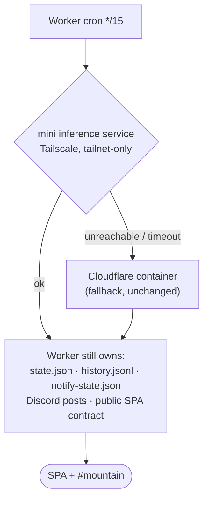

# Proposal: bring inference home, and stop guessing at the model

**Status:** draft for discussion · **Opened:** 2026-07-30

Three questions got bundled together — move inference off Cloudflare, adopt QLoRA
on the mini, and find a better vision backbone. They have different answers, and
one of them is *no*.

---

## 0. The uncomfortable finding first

Before any of this is worth doing, look at the dataset:

| Class | Count | Share |
|---|---|---|
| Not Out | 1735 | **86.3%** |
| Partial | 164 | 8.2% |
| Full | **111** | **5.5%** |

A classifier that answers "Not Out" every single time scores **86.3% accuracy**.
The last training run reported **99.8% val accuracy** and we have been treating
that as a triumph. It is a number dominated by the majority class, computed on a
val split of a few hundred images containing perhaps twenty positives, and the
telemetry reports **no per-class precision or recall at all**.

We do not currently know how well this model detects the mountain. We know how
well it detects fog.

**No backbone change will fix that**, and swapping architectures while blind to
per-class performance means we won't be able to tell whether the swap helped.
Everything below is worth doing — but if only one thing gets done this month, it
is per-class metrics and more Full/Partial labels.

That is also the strongest argument for the uncertainty-driven label requests
that just shipped (#93): they sample precisely the ambiguous frames, which are
disproportionately Partial. That is the label pipeline working on the right
problem.

---

## 1. Move inference to the mini

**Recommendation: yes, with a caveat that matters.**

### What we'd gain

- **Reliability, counterintuitively.** Over 92 ticks on 2026-07-29/30, **3
  failed** (96.7%) — two were Cloudflare container problems: `Failed to start
  container: Network connection lost` and a `ReadTimeout` fetching the webcam.
  Cold-starting a container every 15 minutes is itself the failure mode.
- **No cold-start checkpoint pull.** The container fetches its LoRA weights from
  R2 on every cold start. A resident process loads once.
- **Latency.** Ticks currently take **28–35s** wall clock, nearly all of it cold
  start. A warm local model is sub-second, which makes a tighter cadence
  affordable — the `*/15` cron is a cost decision, not a product one.
- **The training/inference split disappears.** Training already runs on the mini
  against MPS. Today a new checkpoint has to round-trip through R2 and a
  container image rebuild to reach inference. Same box = no round trip.
- **Cost** drops to zero for compute.

### What we'd lose, and this is the caveat

**The mini is an 8 GB M1 and it is already swapping** — 1.5M pageouts, 52% memory
free at idle, with the obsidian-supervisor holding a 6144 MB budget of which 1792
MB is in use, and `mountain-weekly-train` alone budgeted at 3072 MB. Adding a
resident inference process to that box is not free.

It's also a single point of failure with no SLA, on a home internet connection,
in an earthquake zone, that you sometimes reboot. Cloudflare's worst behaviour
this week was a 3.3% tick failure rate. The mini's worst behaviour is "Tommy
closed something".

### Proposed shape

Keep the Worker. Move only the *model*.

This keeps every externally-visible contract identical, gets the latency and
cost win, and means a mini reboot degrades rather than breaks. The Worker already
handles container failure gracefully (it records an `error` history record), so
the fallback path is mostly written.

**Inference runtime on the mini:** Core ML, not PyTorch. Apple's own numbers put
ANE-targeted Core ML meaningfully ahead of Metal for transformer inference (one
published example is 2.8× on an M1 mini, though that's a speech model, not a ViT
— we should measure, not assume). More important than speed: **the ANE is far
more power-efficient than the GPU**, which matters for a box running inference
every few minutes forever. `coremltools` converts the PyTorch model; the ANE
also leaves the GPU free for training.

---

## 2. QLoRA on the mini

**Recommendation: no — not as things stand. It solves a problem we don't have.**

QLoRA exists to make multi-gigabyte base models trainable by keeping the frozen
base in 4-bit. Our base is **ConvNeXt-Tiny: 28.6M parameters, ~114 MB in fp32**.
Quantizing it to 4-bit saves roughly **85 MB** on a machine that is short by
gigabytes. The adapter is 2.1 MB and the head 794 KB.

Training memory here is dominated by **activations and the input pipeline**, not
weights. 4-bit quantization does nothing for those, and it adds
dequantization overhead plus a quality risk on a model already starved for
positive examples.

**QLoRA becomes correct the moment §3 lands a larger backbone.** At DINOv3
ViT-L (300M) or above, 4-bit base + LoRA adapters is exactly right, and MLX
does it automatically — point `--model` at a quantized model and `mlx-lm`
trains QLoRA with no extra flags. So: not now, yes later, and the trigger is the
backbone decision, not the memory pressure.

**On MLX generally:** MLX is built for unified memory and is the better long-term
home on this hardware, but for a 28M-parameter vision encoder it buys little over
PyTorch MPS, which already works and which all our training code targets.
`mlx-tune` does support vision fine-tuning on Apple Silicon if we want to
evaluate it. I'd treat MLX as a §3 consequence, not a standalone migration.

---

## 3. A better backbone

**Recommendation: DINOv3 ViT-B/16, frozen, with a trained head — and cache the
embeddings.**

The state of the art moved. ConvNeXt-Tiny is a 2022 supervised ImageNet model.
The current open-weight leaders are **DINOv3** (Meta, self-supervised, ViT-S 21M
/ ViT-B 86M / ViT-L 300M / ViT-H+ 840M / ViT-7B, plus ConvNeXt variants distilled
from the 7B), **SigLIP 2**, and Meta's **Perception Encoder**. DINOv3 matches or
beats SigLIP 2 and PE on many classification benchmarks, is released under a
commercial-friendly license, and — the part that matters here — is specifically
strong **frozen**, without fine-tuning.

### Why frozen is the win, not a compromise

With 2010 labels and 111 positives, fine-tuning a backbone is how you overfit.
A frozen encoder plus a small head is the textbook regime for this data size,
and it collapses the resource problem:

- **Precompute embeddings once** for all 2010 images (~a few minutes on MPS),
  cache them, and training becomes a logistic-regression-scale problem on 768-dim
  vectors. Training memory drops from 3072 MB to **tens of megabytes**. The
  weekly retrain goes from ~62 minutes to seconds.
- Re-embedding is only needed when the backbone changes, not when labels arrive.
- The dual-input design survives untouched — concatenate the same
  `[visibility, ceiling]` weather vector onto the frozen image embedding, exactly
  as the current 770→256→3 head does.
- On the memory-starved mini this is *strictly cheaper* than what we run today,
  in both training and inference.

### The honest uncertainty

Whether DINOv3 features beat a LoRA-tuned ConvNeXt-Tiny **for this specific
task** is an empirical question I cannot answer from benchmarks. "Is a mountain
faintly visible through haze at 60 km" is a low-contrast, long-range,
fine-grained discrimination that general benchmarks don't represent. Two things
cut in DINOv3's favour — self-supervised features are known to transfer well to
out-of-distribution domains, and it is explicitly strong on dense/fine-grained
tasks — but this needs measuring, not assuming.

**It is cheap to measure.** Frozen embeddings + a head trains in seconds, so we
can evaluate ViT-S, ViT-B, SigLIP 2, and the current model on identical splits
in an afternoon.

---

## 4. Proposed sequence

Ordered so each step is independently useful and the risky one comes last.

- [ ] **Per-class metrics first.** *(in progress — see the per-class-metrics PR.)*
      Add precision/recall/F1 per class and a
      confusion matrix to `--json-summary` and the training embed. Without this
      nothing below can be evaluated. *Cheap, unblocks everything.*
- [ ] **Fix the val split.** With 111 Full examples, a random split may leave
      single digits in val. Stratify it, and report val counts per class.
- [ ] **Backbone bake-off.** Precompute frozen embeddings for DINOv3 ViT-S/B,
      SigLIP 2, and current ConvNeXt-Tiny; train identical heads; compare
      per-class recall on a fixed stratified split. One afternoon.
- [ ] **Adopt the winner** as a frozen encoder + cached embeddings. Retrain
      becomes seconds, not an hour.
- [ ] **Move inference to the mini** behind the Worker, Core ML/ANE, with
      Cloudflare container fallback. Measure tick success rate for a week
      against the 96.7% baseline before removing the fallback.
- [ ] **Revisit QLoRA/MLX** only if the bake-off says a 300M+ backbone wins by
      enough to justify unfreezing it.

## 5. What would change my mind

- If per-class recall on Full/Partial turns out to be *already high*, the
  backbone work is low-value and this becomes purely an infrastructure move.
- If the mini's memory pressure gets worse, inference should stay on Cloudflare
  regardless of what the model becomes — §3 helps either way, since a frozen
  encoder is cheaper to serve in a container too.
- If DINOv3's license has terms the repo's public status can't accept, SigLIP 2
  or Perception Encoder are the fallbacks. *(I read summaries describing it as
  commercial-friendly; someone should read the actual license text before we
  depend on it.)*

## Sources

- [DINOv3 — Meta AI](https://ai.meta.com/blog/dinov3-self-supervised-vision-model/) · [paper](https://arxiv.org/pdf/2508.10104)
- [Perception Encoder](https://arxiv.org/pdf/2504.13181) · [Best Computer Vision Models in 2026 — Roboflow](https://blog.roboflow.com/best-computer-vision-models/)
- [Fine-Tuning on Mac: LoRA & QLoRA with MLX](https://insiderllm.com/guides/fine-tuning-mac-lora-mlx/) · [mlx-tune](https://github.com/ARahim3/mlx-tune)
- [Deploying Transformers on the Apple Neural Engine](https://machinelearning.apple.com/research/neural-engine-transformers)
- Local measurements: `history.jsonl` (tick success/latency), `labels.yaml` (class balance), `system_profiler`, supervisor `/health`.
